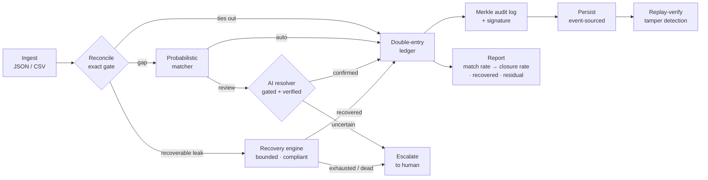

<div align="center">

# RECLAIM

### Reconciliation-Enabled Closed-Loop AI for Integrity & Money-recovery

**Find every rupee that leaks. Win back what's winnable. Prove the books closed.**


`fintech` · `reconciliation` · `revenue-recovery` · `payments` · `double-entry-ledger` · `audit` · `python`

</div>

---

RECLAIM is a closed-loop revenue-integrity engine for online businesses. It reconciles a merchant's money across sources to **detect** every leak, **recovers** the recoverable ones through a bounded, compliant, idempotent workflow, and **re-reconciles to prove the books closed** — leaving a tamper-evident audit trail of every decision, including the actions it deliberately does *not* take.

The design principle is **verification over generation**: a deterministic core owns all money math, and AI-assisted exception resolution is a *gated proposal* that fails safe to a human — it can never cause a wrong match or move money on a guess.

## The problem

Every business that moves money online loses a slice of revenue to **silent leakage** — money that fails to arrive, or arrives short, or is never chased. In India the leak points are large and well-documented:

| Leak point | Scale | Source |
|------------|-------|--------|
| **UPI Autopay** (recurring debits) | Fails **8–15%** of the time vs **2–3%** for card mandates — and much of it is *temporary* (a momentary low balance / bank downtime), i.e. **recoverable**. Late-2025 reporting puts Autopay *success* as low as 30–50%. | [productgrowth.in](https://productgrowth.in/insights/fintech/upi-autopay-guide/), [Mint](https://www.htsyndication.com/mint/article/upi-autopay-s-recurring-woes-are-forcing-an-industry-rethink/93925664) |
| **Checkout / payment success** | Blended merchant success sits at **92–96%**; below 90% is "a serious business problem." Every failed payment is revenue at risk. | [productgrowth.in](https://productgrowth.in/insights/fintech/upi-payment-success-rates/) |
| **Returns (D2C RTO)** | **20–40%** of orders return to origin (fashion 40%+); COD RTO **~26%** vs **<2%** prepaid, at a fully-loaded **₹450–900 per undelivered COD parcel**. | [ClickPost](https://www.clickpost.ai/blog/rto-reduction-tools), [HillTeck](https://www.hillteck.com/blog/reduce-rto-ecommerce-india.html) |
| **Settlement complexity** | Every gateway payout arrives net of stacked deductions (MDR + GST-on-MDR + TCS) and is still reconciled **by hand in spreadsheets**. | [AI Accountant](https://www.aiaccountant.com/blog/payment-reconciliation-platform-india-2025) |
| **Fraud (India, RBI)** | Bank fraud reached **₹48,021 cr in FY26** (up from ₹36,014 cr in FY25). | [Business Standard / RBI](https://www.business-standard.com/finance/news/bank-fraud-amount-triples-in-fy25-despite-drop-in-number-of-cases-rbi-125052900696_1.html) |

**This is a winnable problem — proven at scale.** Stripe's recovery tooling reclaimed **$6 billion** in falsely-declined payments in 2024 alone, and Deliveroo won back **£100 million+** using smart retries. The money is recoverable; most businesses just never close the loop. ([Stripe: Adaptive Acceptance](https://stripe.com/blog/ai-enhancements-to-adaptive-acceptance), [Stripe: Smart Retries](https://stripe.com/blog/how-we-built-it-smart-retries))

### Why existing tools don't solve it

- **Reconciliation tools** find *what* money didn't arrive — then hand a dead exception list to a human. They detect; they don't recover.
- **Dunning / recovery tools** retry a *known* failed debit — but they're blind to leaks that don't look like failed debits (short settlements, missing payouts, abandoned checkouts), and they can't prove they recovered everything.

Two half-loops, no one closes it. And because **UPI runs at zero MDR**, margin has moved off the rails and onto exactly this kind of value-added service — reconciliation, risk, and recovery.

### The need

A single system that **detects every leak, recovers what's recoverable within compliance limits, and proves the books closed** — with a tamper-evident audit trail. That is RECLAIM.

## Highlights

- **Closed loop** — detect → recover → book → audit → persist → verify, in one system, ending on a
  **detection rate → closure rate** pair rather than one flattering number.
- **Exact money** — `Decimal` end to end, never floating point, enforced from the core to the I/O boundary.
- **Two-brain reconciliation** — an exact deterministic gate, a probabilistic (fuzzy) matcher, and an AI-assisted, adversarially-verified resolver for the ambiguous middle.
- **Bounded, compliant recovery** — RBI 24-hour pre-debit notice, capped attempts, stopping rules, and idempotent charges (no double-billing).
- **Provable integrity** — an immutable double-entry ledger (`debits == credits`), a Merkle transparency log with inclusion proofs, and HMAC signing.
- **Durable & replayable** — event-sourced persistence; re-persisting a run is a no-op, and a stored run can be re-verified and tamper-detected at any time.
- **…or nothing** — a replay with no trust anchor is *refused*, not passed. A Merkle log re-roots
  itself after tampering, so self-consistency alone proves nothing, and we don't pretend otherwise.
- **Fully tested** — 19 modules, **338 tests, 100% line + branch coverage**, zero runtime dependencies.

## The loop



## Quick start

```bash
cd reclaim-engine

python -m pytest --cov=reclaim --cov-branch      # 338 tests, 100% line + branch
python -m reclaim.demo                            # run the full loop (demo data)
python -m reclaim examples/sample_batch.json      # reconcile a JSON batch
python -m reclaim --csv examples/sample_batch.csv # …or CSV
```

Persist a run and verify it later (tamper-evident):

```bash
python -m reclaim examples/sample_batch.json --store ./run --key-file key.bin
python -m reclaim --replay ./run --key-file key.bin        # anchored by run/root.txt
```

`--store` publishes the audit root to `run/root.txt`, which anchors a later `--replay`. A replay with
no anchor (`root.txt`, `--expect-root`, or `--key-file`) **refuses and exits 2** — deleting audit
events lets a Merkle log recompute a valid root of the survivors, so an unanchored replay cannot
detect tampering ([ADR-0015](reclaim-engine/docs/decisions/ADR-0015-anchored-replay.md)).

Open `reclaim-engine/examples/demo_dashboard.html` for the visual run report.

**→ [`reclaim-engine/docs/RUNBOOK.md`](reclaim-engine/docs/RUNBOOK.md)** — a one-page demo runbook:
every command above with its exact expected output, the sample data explained row by row, and the
tamper-detection walkthrough. No install, no network, no keys.

## Architecture at a glance

Every box below is a real, tested module in `reclaim-engine/src/reclaim/`. The two dashed boxes are
the *only* places the outside world touches the engine — both are protocol seams with deterministic
fakes in the test suite, so the entire system is provable offline.

```mermaid
flowchart LR
    IN["<b>Settlements</b><br/>+ bank credits<br/><br/>JSON / CSV"]

    subgraph F["0 · FOUNDATION"]
        direction TB
        IO["<b>batch_io · csv_io</b><br/>validating I/O boundary<br/>amounts as strings"]
        MO["<b>money · domain</b><br/>exact Decimal Money<br/>canonical types"]
        IO --> MO
    end

    subgraph D["1 · DETECT — two-brain reconciliation"]
        direction TB
        EX["<b>reconciliation</b><br/>exact gate: UTR + amount<br/>after fee decomposition<br/>emits typed leaks"]
        FZ["<b>probabilistic</b><br/>Fellegi-Sunter linkage<br/>auto / review / residual"]
        AI["<b>resolver</b><br/>gated AI: self-consistency<br/>+ confidence + refute-first<br/>verifier"]
        EX -->|"no exact match"| FZ
        FZ -->|"review band"| AI
    end

    subgraph R["2 · RECOVER"]
        direction TB
        RC["<b>recovery</b><br/>root-cause diagnosis<br/>RBI 24h notice · capped<br/>attempts · stopping rules<br/>· idempotent"]
    end

    LG["<b>3 · BOOK</b><br/><br/><b>ledger</b><br/>immutable<br/>double-entry<br/><br/>debits = credits"]

    subgraph P["4 · PROVE"]
        direction TB
        AU["<b>audit</b><br/>Merkle log<br/>+ inclusion proofs"]
        SG["<b>signing</b><br/>HMAC-SHA256<br/>over the root"]
        PS["<b>persistence</b><br/>event-sourced<br/>append-only JSONL"]
        VF["<b>verification</b><br/>replay + tamper<br/>detection"]
        AU --> SG
        PS --> VF
    end

    OUT["<b>5 · REPORT</b><br/><br/><b>pipeline · cli<br/>dashboard</b><br/><br/>match rate<br/>→ ₹ recovered<br/>→ residual"]
    HUM["<b>Human queue</b><br/>honest exception list<br/><i>never a guess</i>"]

    LLM["<b>ChatClient</b> seam<br/><i>llm_resolver</i><br/>→ Anthropic Claude"]
    PAY["<b>PaymentGateway</b> seam<br/><i>payments</i><br/>→ Razorpay test mode"]

    IN --> IO
    MO --> EX
    EX -->|"ties out"| LG
    FZ -->|"auto"| LG
    AI -->|"confirmed"| LG
    AI -->|"uncertain / any error"| HUM
    EX -->|"recoverable leak"| RC
    RC -->|"recovered"| LG
    RC -->|"exhausted / dead mandate"| HUM
    LG --> AU
    LG --> PS
    LG --> OUT
    AU --> OUT
    HUM --> OUT

    LLM -.->|"plugs in"| AI
    PAY -.->|"plugs in"| RC

    classDef found fill:#eef2f8,stroke:#6a768c,color:#14203a
    classDef detect fill:#eaf1ff,stroke:#2f6fd0,color:#14203a
    classDef recov fill:#fff3e8,stroke:#b8531a,color:#14203a
    classDef book fill:#e8eefb,stroke:#0b3b8f,stroke-width:2px,color:#0b3b8f
    classDef prove fill:#e6f6ed,stroke:#1a7f4b,color:#14203a
    classDef seam fill:#ffffff,stroke:#8a93a6,stroke-dasharray:5 4,color:#556
    classDef edge fill:#f4f7fc,stroke:#6a768c,color:#14203a
    class IO,MO found
    class EX,FZ,AI detect
    class RC recov
    class LG book
    class AU,SG,PS,VF prove
    class LLM,PAY seam
    class IN,OUT,HUM edge

    style F fill:#fbfcfe,stroke:#c3cbd9,stroke-width:1px,color:#6a768c
    style D fill:#f7faff,stroke:#9ec0f0,stroke-width:1px,color:#2f6fd0
    style R fill:#fffaf6,stroke:#e8bfa0,stroke-width:1px,color:#b8531a
    style P fill:#f6fcf9,stroke:#a9d8bf,stroke-width:1px,color:#1a7f4b
```



**Read it in one line:** exact money in → detect every leak with a deterministic gate first and AI
only in the ambiguous middle → recover what's recoverable within compliance limits → book it all to
a balanced double-entry ledger → prove the result is untampered → report three honest numbers, with
everything the engine *couldn't* settle sent to a human rather than guessed.

### Module map

| Layer | Module | Responsibility |
|-------|--------|----------------|
| Money | `money` | Exact, currency-safe `Decimal` value type |
| Domain | `domain` | Canonical Transaction / Fees / LedgerEntry / LeakRecord |
| I/O | `batch_io` · `csv_io` | Validating JSON / CSV boundary (amounts as strings → exact `Money`) |
| Ledger | `ledger` | Immutable, idempotent double-entry ledger (`debits == credits`) |
| Detect | `reconciliation` | Exact settlement↔bank matching + typed leak detection |
| Detect | `probabilistic` | Fellegi-Sunter-style fuzzy matcher (auto / review / residual) |
| Detect | `resolver` · `llm_resolver` | Gated resolver (self-consistency + confidence + adversarial verifier); LLM backend |
| Recover | `recovery` · `payments` | Diagnosis + bounded compliant workflow; payment-gateway executor |
| Integrity | `audit` · `signing` | Merkle transparency log + inclusion proofs; HMAC signing |
| Durability | `persistence` · `verification` | Event-sourced storage; replay + tamper verification |
| Orchestration | `pipeline` · `cli` · `dashboard` · `demo` | End-to-end run, CLI, HTML report, runnable demo |

`pipeline` reports **two** rates: `match_rate` (detection, before recovery) and `closure_rate`
(after recovery). They are kept separate on purpose — one number cannot show that recovery moved
anything ([ADR-0014](reclaim-engine/docs/decisions/ADR-0014-closure-rate.md)).

Every significant design decision is recorded as an Architecture Decision Record in [`reclaim-engine/docs/decisions/`](reclaim-engine/docs/decisions/) (16 ADRs).

## Repository layout

```
.
├── reclaim-engine/                     the engine — Python 3.11+, src layout, zero runtime deps
│   ├── src/reclaim/                    19 modules
│   │   ├── money.py  domain.py         exact Decimal money + canonical types
│   │   ├── ledger.py                   immutable double-entry ledger
│   │   ├── reconciliation.py           exact matching + typed leak detection
│   │   ├── probabilistic.py            Fellegi-Sunter fuzzy linkage
│   │   ├── resolver.py                 gated AI resolver (protocol + verifier)
│   │   ├── llm_resolver.py             LLM backend behind the ChatClient seam
│   │   ├── recovery.py                 bounded, compliant, idempotent recovery
│   │   ├── payments.py                 gateway executor behind the PaymentGateway seam
│   │   ├── audit.py  signing.py        Merkle transparency log + HMAC signing
│   │   ├── persistence.py              event-sourced append-only storage
│   │   ├── verification.py             replay + tamper detection
│   │   ├── batch_io.py  csv_io.py      validating JSON / CSV input boundary
│   │   ├── pipeline.py                 end-to-end orchestration → RunReport
│   │   ├── cli.py  __main__.py         `python -m reclaim`
│   │   ├── dashboard.py                self-contained HTML run report
│   │   └── demo.py                     `python -m reclaim.demo`
│   ├── tests/                          27 files · 338 tests · 100% line + branch
│   ├── docs/
│   │   ├── RUNBOOK.md                  one-page reproducible demo
│   │   ├── BUILD-LOG.md                what was built, why, how it was tested
│   │   └── decisions/                  16 Architecture Decision Records
│   ├── examples/                       sample_batch.json · .csv · demo_dashboard.html/.png
│   ├── pyproject.toml                  project + pytest/coverage config
│   └── README.md                       engine-level docs
├── fintech-grid/                       India-first market research (value-chain grids)
├── RECLAIM-Product-Document.md         product & company vision
├── RECLAIM-System-Architecture.md      full system design (target architecture)
├── CONTRIBUTING.md   LICENSE (MIT)
└── README.md                           you are here
```

## What is real, and what is simulated

Stated plainly so nobody has to infer it from the code.

| Capability | Status |
|---|---|
| Reconciliation, fee decomposition, fuzzy linkage, leak detection | **Real** — deterministic, fully tested |
| Double-entry ledger, balance invariant, idempotent postings | **Real** |
| Merkle audit log, inclusion proofs, anchored replay, tamper detection | **Real** — demonstrated in the runbook |
| Event-sourced persistence, idempotent re-persist, byte-stable artifacts | **Real** |
| Gated AI exception resolution | **Real code** — `llm_resolver` is a working Anthropic backend; the offline demo uses deterministic fakes |
| Payment execution | **Seam only** — `payments` wraps a real Razorpay test-mode client, but the demo runs a stand-in executor |
| **Recovered ₹ figures in the demo** | **Simulated** — a deterministic stand-in decides success; no money moves |
| **RBI 24-hour pre-debit notice** | **Modelled, not sent** — the notice time is recorded and attempts are scheduled after it; there is no notification action or notice executor |
| **Causal uplift / control group** | **Not implemented** — no holdout assignment, no measured lift. Sprint 2 scope |

The recovery *workflow* — root-cause diagnosis, the 24-hour window, capped attempts, channel
rotation, stopping rules, idempotency keys — is real, tested, and enforced in code. What is
simulated is only the **outcome** of each attempt. Both external integrations sit behind protocol
seams with deterministic fakes, which is why the system is provable offline; "provable offline" is
not the same as "proven in production", and this project does not claim it is.

## Engineering guarantees

- Money is exact (`Decimal`), never float.
- Money actions are idempotent — a retried recovery never double-charges.
- Any resolver or gateway failure degrades to "escalate to a human," never a wrong match.
- Runs are deterministic and replayable — same inputs produce the same audit root, on any platform.
- Persisting the same run twice is a no-op; a re-run never looks like tampering.
- A verification result is never reported without naming the anchor it was checked against.
- The core runs on the Python standard library; external integrations are optional, behind clean interfaces.

## License

Released under the [MIT License](LICENSE).

## Author

**Adil Mahajan** — University of Jammu.
