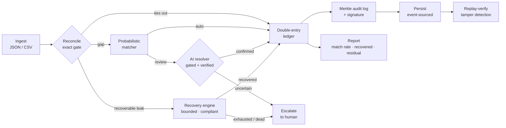

<div align="center">

# RECLAIM

### Reconciliation-Enabled Closed-Loop AI for Integrity & Money-recovery

**Find every rupee that leaks. Win back what's winnable. Prove the books closed.**


`fintech` · `reconciliation` · `revenue-recovery` · `payments` · `double-entry-ledger` · `audit` · `python`

</div>

---

RECLAIM is a closed-loop revenue-integrity engine for online businesses. It reconciles a merchant's money across sources to **detect** every leak, **recovers** the recoverable ones through a bounded, compliant, idempotent workflow, and **re-reconciles to prove the books closed** — leaving a tamper-evident audit trail of every decision, including the actions it deliberately does *not* take.

The design principle is **verification over generation**: a deterministic core owns all money math, and AI-assisted exception resolution is a *gated proposal* that fails safe to a human — it can never cause a wrong match or move money on a guess.

## Highlights

- **Closed loop** — detect → recover → book → audit → persist → verify, in one system.
- **Exact money** — `Decimal` end to end, never floating point, enforced from the core to the I/O boundary.
- **Two-brain reconciliation** — an exact deterministic gate, a probabilistic (fuzzy) matcher, and an AI-assisted, adversarially-verified resolver for the ambiguous middle.
- **Bounded, compliant recovery** — RBI 24-hour pre-debit notice, capped attempts, stopping rules, and idempotent charges (no double-billing).
- **Provable integrity** — an immutable double-entry ledger (`debits == credits`), a Merkle transparency log with inclusion proofs, and optional HMAC signing.
- **Durable & replayable** — event-sourced persistence; a stored run can be re-verified and tamper-detected at any time.
- **Fully tested** — 18 modules, **322 tests, 100% line + branch coverage**.

## The loop



## Quick start

```bash
cd reclaim-engine

python -m pytest --cov=reclaim --cov-branch      # 322 tests, 100% line + branch
python -m reclaim.demo                            # run the full loop (demo data)
python -m reclaim examples/sample_batch.json      # reconcile a JSON batch
python -m reclaim --csv examples/sample_batch.csv # …or CSV
```

Persist a run and verify it later (tamper-evident):

```bash
python -m reclaim examples/sample_batch.json --store ./run --key-file key.bin
python -m reclaim --replay ./run --expect-root <ROOT> --key-file key.bin
```

Open `reclaim-engine/examples/demo_dashboard.html` for the visual run report.

## Architecture

| Layer | Module | Responsibility |
|-------|--------|----------------|
| Money | `money` | Exact, currency-safe `Decimal` value type |
| Domain | `domain` | Canonical Transaction / Fees / LedgerEntry / LeakRecord |
| Ledger | `ledger` | Immutable, idempotent double-entry ledger (`debits == credits`) |
| Detect | `reconciliation` | Exact settlement↔bank matching + typed leak detection |
| Detect | `probabilistic` | Fellegi-Sunter-style fuzzy matcher (auto / review / residual) |
| Detect | `resolver` · `llm_resolver` | Gated resolver (self-consistency + confidence + adversarial verifier); LLM backend |
| Recover | `recovery` · `payments` | Diagnosis + bounded compliant workflow; payment-gateway executor |
| Integrity | `audit` · `signing` | Merkle transparency log + inclusion proofs; HMAC signing |
| Durability | `persistence` · `verification` | Event-sourced storage; replay + tamper verification |
| Orchestration | `pipeline` · `cli` · `dashboard` | End-to-end run, CLI, HTML report |

Every significant design decision is recorded as an Architecture Decision Record in [`reclaim-engine/docs/decisions/`](reclaim-engine/docs/decisions/).

## Repository layout

```
reclaim-engine/          the engine (src layout, pytest)
  src/reclaim/           18 modules
  tests/                 322 tests, 100% line + branch
  docs/decisions/        Architecture Decision Records
  examples/              sample batches + demo dashboard
RECLAIM-Product-Document.md        product & company vision
RECLAIM-System-Architecture.md     system design
fintech-grid/                      India-first market research (value-chain grids)
```

## Engineering guarantees

- Money is exact (`Decimal`), never float.
- Money actions are idempotent — a retried recovery never double-charges.
- Any resolver or gateway failure degrades to "escalate to a human," never a wrong match.
- Runs are deterministic and replayable — same inputs produce the same audit root.
- The core runs on the Python standard library; external integrations are optional, behind clean interfaces.

## License

Released under the [MIT License](LICENSE).

## Author

**Adil Mahajan** — University of Jammu.
