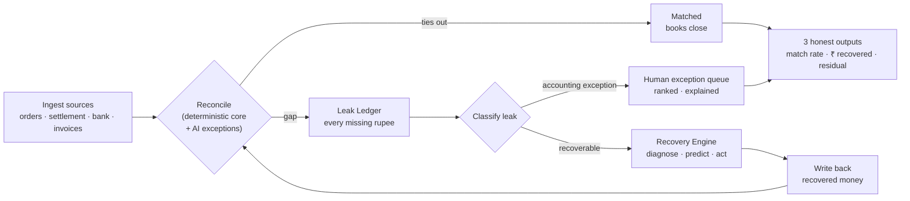
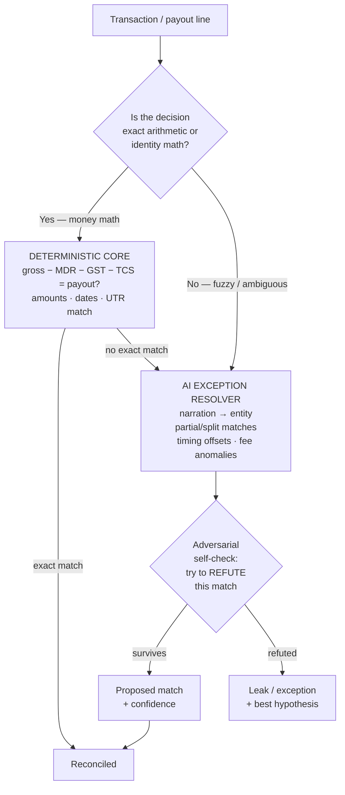
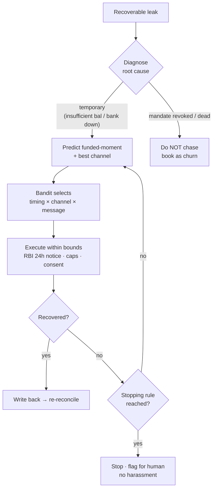
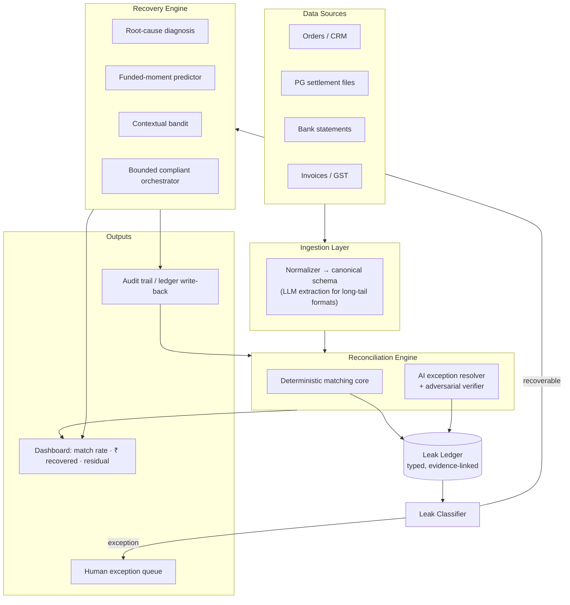
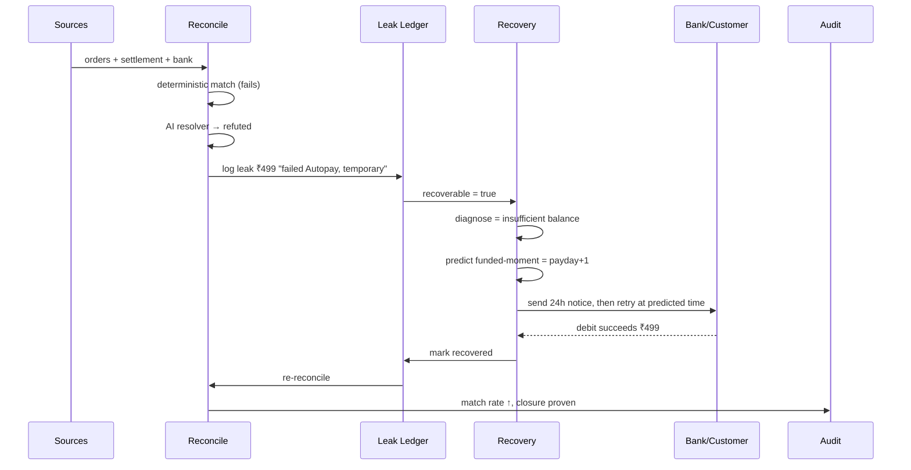

# RECLAIM

### *Reconciliation-Enabled Closed-Loop AI for Integrity & Money-recovery*

> **Find every rupee that leaks. Win back what's winnable. Prove the books closed.**

---

**Document type:** Product & company vision — v1.0
**Context:** India primary market, global secondary · built on the *India Fintech Value-Chain Research* (see `fintech-grid/`) · domain: revenue recovery · written as a real product.
**Discipline:** Factual market claims are sourced and carry a confidence level; product/architecture design is clearly separated as *design intent*. Where a number is an estimate, its assumptions and arithmetic are shown.

---

## 1. Executive Summary

Every business that moves money online loses a slice of its revenue to **silent leakage** — payments that fail, subscriptions that lapse on a temporary glitch, settlements that arrive short, invoices that go overdue, and books that never quite tie out. In India this leakage is structurally large: UPI Autopay debits fail at a **materially higher rate than cards** (reported variously as 8–15%, and by some late-2025 accounts far higher — sources conflict; see architecture doc), D2C return-to-origin runs **20–40%**, and payment-gateway settlements arrive **net of stacked deductions** (MDR, GST-on-MDR, TCS) that finance teams still reconcile **by hand** in spreadsheets.

Today two separate categories of tool each solve *half* of this and neither closes the loop:

- **Reconciliation tools** are the *eyes* — they find what money didn't arrive, then hand a dead exception list to a human. They fix nothing.
- **Recovery / dunning tools** are the *hands* — they retry a *known* failed payment, but they're blind to leaks that don't look like failed debits, and they can't prove they recovered everything.

**RECLAIM is the first system to close the loop.** It reconciles a business's money across every source to detect **all** leaks, classifies each leak as *recoverable* or *accounting exception*, autonomously recovers the recoverable ones through a **bounded, compliant, measured** workflow, and then **re-reconciles to prove the books closed** — ending on three honest numbers: **match rate → rupees causally recovered → the residual exceptions a human still owns**, with a complete audit trail.

The wedge is India's post-transaction lifecycle, where UPI's near-free rails (zero-MDR today; a small large-merchant MDR is now *enabled* by the 2026 Taxation Laws Amendment but not yet live) have pushed fintech margin into **value-added services** exactly like this one. The long-term company is the **revenue-integrity layer** for the agentic economy.

---

## 2. The Name

**RECLAIM** — **R**econciliation-**E**nabled **C**losed-**L**oop **A**I for **I**ntegrity & **M**oney-recovery.

The word was chosen because it *is* the product: to **reclaim** is to get back what is rightfully yours. Each letter names a real pillar of the system:

| Letter | Pillar | Meaning in the product |
|---|---|---|
| **R** | Reconciliation | The detection engine — sees every leak in money terms |
| **E** | Enabled | Recovery is *driven by* what reconciliation finds, not guessed |
| **C** | Closed | The loop closes — recovered money is written back and re-verified |
| **L** | Loop | Detect → recover → prove, continuously |
| **A** | AI | Applied with judgment, only where judgment is needed |
| **I** | Integrity | The books are provably whole; nothing is hidden or hallucinated |
| **M** | Money-recovery | The outcome measured in rupees, causally |

---

## 3. The Problem — Revenue Leaks Silently, Everywhere

### 3.1 The three-ledger gap

A merchant selling online holds three records that are *supposed* to agree but rarely do:

```
  ORDERS / BOOKS          PG SETTLEMENT FILE           BANK STATEMENT
  "240 sales,             "paying you ₹4,78,320         "NEFT credit
   ₹5,00,000"              (gross − MDR − GST            ₹4,78,320"
                           − TCS − refunds)"
        \                        |                          /
         \                       |                         /
          `------------  DO THESE TIE OUT?  --------------`
                    (today: a human, in a spreadsheet)
```

The gap between them is not one error — it is **deductions stacked on deductions, netted across days**. Reconciling it means proving *which* orders map to *which* payout after *which* fees, and chasing whatever doesn't. When something is missing, the merchant faces a second question the reconciliation tool can't answer: **is that missing money recoverable, and if so, how?**

### 3.2 The leakage is structurally large in India *(sourced)*

| Leak type | Figure | Source | Confidence |
|---|---|---|---|
| UPI Autopay mandate failure | **8–15%** (vs 2–3% for card mandates); much of it *temporary* (insufficient balance / bank downtime), i.e. recoverable | productgrowth.in (UPI Autopay guide) | Medium |
| Blended merchant payment success | **92–96%** (below 90% = "serious business problem") | productgrowth.in | Medium |
| D2C return-to-origin (RTO) | **20–35%**, 40%+ in fashion; COD ~26% vs <2% prepaid; **₹450–900 fully-loaded cost per undelivered COD** | ClickPost / HillTeck | Medium / Low-Med |
| PG settlement complexity | Payout = gross − MDR − **GST on MDR** − TCS, netted; must be *unpacked* before matching | AI Accountant | Medium |
| Manual-effort reduction possible from recon automation | **~75%** | AI Accountant / Moveo | Low-Med (vendor) |

> **Why it stays unsolved:** the money that leaks is *individually small and contextually complex* — a ₹499 subscription, an ₹18 fee discrepancy, a ₹2,100 refunded order split across two payouts. It is beneath the attention of a CFO and beyond the patience of a spreadsheet, so it is silently written off. Multiplied across a business's transaction volume, it is a material fraction of revenue.

---

## 4. Why Now

1. **UPI has been zero-MDR** (free), so India's payment *margin* sits in **value-added services** — reconciliation, risk, and recovery. *(Verified update: a small large-merchant MDR is now enabled by the 2026 Taxation Laws Amendment but not yet implemented; UPI stays free for consumers. Confidence: High on the direction.)*
2. **The 2026 builder consensus is that verification capacity, not generation speed, is the bottleneck.** RECLAIM is a verification-first product by construction. *(Confidence: Medium — widely-held thesis, directionally supported.)*
3. **Regulatory scaffolding now makes compliant automation templatable:** RBI's e-mandate rules (recurring debits ≤ ₹15,000 without OTP; **mandatory 24-hour pre-debit notification**), and the ongoing CBIC GST e-invoicing threshold reduction (₹5 cr today; reportedly → ₹2 cr ~Oct 2025) that pulls far more SMBs into structured, reconcilable data. *(Confidence: Medium-High; exact threshold/date to confirm with a CBIC notification.)*
4. **Cheap, capable LLMs** finally make the *fuzzy* parts of reconciliation and recovery (narration parsing, root-cause reasoning, exception explanation) tractable — while the *exact* parts stay deterministic.

---

## 5. The Core Insight — Two Halves of One Loop

Reconciliation and recovery have always been sold as separate categories. They are actually **two arcs of a single loop**, and each covers the other's fatal blind spot:

| | Reconciliation alone | Recovery alone | **RECLAIM (combined)** |
|---|---|---|---|
| Role | Eyes | Hands | Eyes → Hands → Proof |
| Sees every leak type? | Yes | **No** — only failed debits | **Yes** |
| Acts to recover? | **No** | Yes | **Yes** |
| Proves books closed? | Partially | **No** | **Yes — re-reconciles** |
| Failure mode | Dead exception list in an inbox | Blind to non-obvious leaks; unmeasured | — |

The join is the thing nobody has built: **the reconciliation exception is the recovery trigger, and the recovery outcome is the next reconciliation input.** Money you win back stops being an exception — *the books literally close as you recover.*

---

## 6. What RECLAIM Is

RECLAIM is a **closed-loop revenue-integrity engine**. It ingests a business's financial sources, reconciles them, and turns the result into action and proof.



The loop never ends on a match rate alone (which any tool can cherry-pick). It ends on **three numbers that cannot be faked together**: how much tied out, how much was *causally* won back, and exactly what a human still has to resolve.

---

## 7. How It Works — The Pipeline

### 7.1 Ingestion & Normalization
Connectors pull the raw sources — order/CRM exports, PG settlement files (Razorpay/PayU/Cashfree), bank statements (multiple Indian bank formats), invoices/GST data. A normalization layer maps every heterogeneous format into a **canonical transaction schema** (Appendix B). This is where cheap LLM extraction earns its place: parsing the long tail of Indian bank narration and PDF statements that break rule-based parsers.

### 7.2 The Reconciliation Engine — a deliberate two-brain design

This is the heart of the AI-judgment philosophy (§11). The engine has **two brains** and routes each decision to the correct one:



- **Deterministic core** — never lets AI "decide" that ₹98,432 ≈ ₹98,401. A recon tool that hallucinates a match is worse than useless: it *hides* the error it exists to find. So exact money math is code.
- **AI exception resolver** — reasons only about the genuinely fuzzy joints, and every AI-proposed match must survive an **adversarial self-check** (an agent that actively tries to *refute* the match before it's accepted). Whatever survives carries a calibrated confidence; whatever doesn't becomes a leak with a stated hypothesis.

### 7.3 The Leak Ledger
Every rupee that doesn't reconcile lands in a structured **Leak Ledger** — not a flat list, but a typed record: `{amount, type, source_refs, hypothesis, confidence, recoverable?, evidence}`. This is the shared spine that makes the two halves one system.

### 7.4 The Leak Classifier
Each leak is classified along two axes:
- **Recoverable vs. accounting-exception** (is there money to win back, or is this a booking/timing/data issue for a human?).
- **Leak type** — failed debit, retriable mandate, short-paid invoice, abandoned checkout, missing settlement, overdue receivable, unexplained fee.

Recoverable leaks flow to the Recovery Engine; exceptions flow to a **ranked, explained human queue** (never silently dropped).

### 7.5 The Recovery Engine
For each recoverable leak, RECLAIM runs a **bounded, compliant, measured** recovery workflow:



Its intelligence is in **prediction and restraint**, not messaging:
- **Root-cause diagnosis** — separate temporary failures (recoverable) from dead mandates (don't waste effort, don't harass).
- **Funded-moment prediction** — a per-customer model of *when* an account is likely funded (e.g. after a probable salary-credit day); retrying at the right minute is the single biggest lever, because much failure is temporary.
- **Contextual bandit** — learns the best `(timing × channel × message)` combination over time. India signal: **WhatsApp + UPI link recovers ~3× vs email.**
- **Bounded, compliant orchestration** — every action respects RBI's 24-hour pre-debit notice, per-customer contact caps, consent, and **stopping rules** so recovery never becomes harassment.

### 7.6 Write-back & Re-reconciliation — proving closure
Recovered money is written back and the loop **re-reconciles**. This is the step no competitor has: the system doesn't just *claim* it recovered money — it **shows the books now tie out** to a higher match rate than before. Closure is proven, not asserted.

### 7.7 Audit & Explainability
Every match, every recovery action, every decision *not* to act is logged with its reason and evidence, producing a tamper-evident audit trail — a statutory expectation for books *and* the trust primitive that makes an autonomous money-mover adoptable.

---

## 8. System Architecture



**Design notes for the engineering team:**
- The **deterministic core and AI resolver are separate services** with a hard interface — the core must be independently testable and never depend on model output for arithmetic.
- The **Leak Ledger is the source of truth and the integration seam** between reconciliation and recovery; both halves read/write it.
- **Every AI output is a *proposal* gated by a verifier or a deterministic check** — the system is designed so that a model failure degrades to "flag for human," never to "silent wrong match" or "silent wrong debit."
- **Idempotency and reversibility** are first-class in the orchestrator: no recovery action is irreversible without an explicit, logged, human-consented gate.

---

## 9. The Lifecycle of One Leak



---

## 10. Worked Example — End to End

RECLAIM ingests a mid D2C brand's cycle: **240 orders (₹5,00,000)**, one Razorpay settlement file, one bank statement, plus **200 failed ₹499 subscription debits**.

**Reconciliation output:**
> **Match rate: 94%** (₹4.51L of ₹4.78L auto-reconciled).
> **Leak Ledger (3 exception types):**
> 1. Payout ₹12,300 has no matching orders → *hypothesis: belongs to a settlement 2 days later (timing)*. **Confidence: High → accounting exception.**
> 2. Order #1187 (₹2,100) in books, missing from settlement → *hypothesis: refunded pre-settlement, refund record absent*. **Confidence: Medium → human queue.**
> 3. Fee on payout #44 is ₹18 above expected MDR+GST → *could not explain*. **Confidence: none → human queue (flagged honestly).**

**Recovery output (the 200 failed debits):**
> **Recovered: ₹63,700 of ₹99,800 (64%).**
> **Causal lift vs held-out control: +38 pts** (control self-recovered 26%; treated 64%).
> - 112 diagnosed *temporary* → retried at predicted funded-moment → **89 recovered.**
> - 41 nudged via WhatsApp+UPI link after 24h notice → **₹18,900 won back.**
> - 24 diagnosed *dead mandate* → **not chased** (correctly).
> - 23 unresolved after 2 compliant attempts → **stopped per rules, flagged.**

**Closure:**
> After write-back, **re-reconciled match rate rises to 99.2%**; residual = 2 human-queue exceptions + 23 exhausted recoveries. **Books provably closed to the rupee.**

The demo ends on the three numbers — **94%→99.2% match · ₹63,700 causally recovered · a short honest residual** — and the two moments that read as judgment: *"I could not explain this ₹18 fee"* and *"I deliberately did not chase the 24 dead mandates."*

---

## 11. The AI-Judgment Philosophy — *where we deliberately don't use AI*

This is the moat, and it inverts the industry reflex. In a world where every competitor sprays AI at everything, RECLAIM's differentiator is **restraint**:

- **Money math is deterministic.** Amounts, dates, UTR/RRN identity, fee arithmetic — code, not model. Non-negotiable.
- **AI is confined to genuinely ambiguous reasoning** — narration→entity, split/partial matches, root-cause hypotheses, natural-language explanations — and **every AI output is gated** by a deterministic check or an adversarial verifier.
- **The system degrades safely.** A model error can only ever produce "flag for human," never a silent wrong match or a wrong debit.
- **Honesty is a feature.** A real exception list ("I couldn't resolve these 3") and a control-group-measured recovery number are things a prompt-and-pray competitor structurally *won't* produce — because both require admitting limits.

> This is the crux of trustworthy AI for money — *the right tool in the right place, and knowing where not to use one* — the 2026 verification-over-generation thesis, made literal.

---

## 12. Measurement & Honesty

RECLAIM refuses vanity metrics. Its scorecard is defined so it cannot be gamed:

| Metric | Definition | Why it's honest |
|---|---|---|
| **Match rate** | ₹ auto-reconciled ÷ total ₹, over a full batch | Batch-level, not cherry-picked ("one match proves nothing") |
| **Residual exception list** | Every unresolved item, ranked, with hypothesis + confidence | Surfacing failure is the product |
| **₹ causally recovered** | Recovered ₹ in treated group **minus** held-out control baseline | Proves *we* recovered it, not that it self-recovered |
| **False-positive / harassment rate** | Wrong debits attempted; contacts beyond policy | Guards the downside; builds trust |
| **Time-to-closure** | Cycle time from ingest to proven closure | The operational value to a finance team |

---

## 13. Compliance, Trust & Security

- **RBI e-mandate rules** — recurring debits ≤ ₹15,000 without OTP once e-mandate set; **mandatory 24-hour pre-debit notification** enforced by the orchestrator.
- **Collections conduct** — RBI norms on how/when a debtor may be contacted are encoded as hard **stopping rules**; recovery can *never* exceed them.
- **DPDP (data protection)** — customer + payment data handled under India's data law; least-privilege, purpose-bound.
- **Audit trail** — statutory for books; tamper-evident; every action and *inaction* explained.
- **Reversibility & idempotency** — no irreversible money action without a logged, consented gate.

*(Confidence: Medium-High on the rules cited; specific circulars to be confirmed with payments-compliance counsel — see §18.)*

---

## 14. Market & Business Model

### 14.1 Where the money is *(sourced, with a bottom-up estimate)*
India's monetisable fintech pool sits in **value-added services on free rails** (§4). A bottom-up sizing of the merchant-software wedge RECLAIM sells into (full method and assumptions in the research doc):

```
Digitally-active small businesses            ≈ 6.3 million   [IBEF, Low-Med]
× reachable with a paid product              × 15%           [ASSUMPTION]
= serviceable merchants                      ≈ 0.95 million
× annual revenue per merchant                × ₹6,000/yr      [ASSUMPTION]
= serviceable revenue pool                   ≈ ₹567 crore/yr (~US$68M/yr)
Sensitivity (5–30% reach, ₹3k–12k ARPU): ~₹100 cr to ~₹2,300 cr/yr
```
> **Confidence: Low on the absolute number, Medium on method.** The two swing factors (reach %, ARPU) are the first things to validate (§18). RECLAIM's *outcome-based* pricing (below) makes reach and ARPU move together with value delivered.

### 14.2 Ideal customer profile (ICP)
- **Wedge:** subscription/D2C businesses on Razorpay-class gateways, ₹5–100 cr GMV, with (a) recurring UPI Autopay revenue and (b) manual reconciliation pain. High failure rates + high recon burden = highest RECLAIM value.
- **Expansion:** mid-market finance teams, marketplaces, lenders (EMI recovery), and eventually enterprises.

### 14.3 Pricing — aligned to outcome
- **Base platform fee** (reconciliation + leak ledger) — predictable SaaS.
- **Success fee on causally-recovered rupees** — RECLAIM only wins when the customer wins, and the control-group measurement makes the success fee *provable*. This is the pricing model competitors can't credibly offer, because they can't prove causal recovery.

### 14.4 Go-to-market
1. Land via the reconciliation pain (universal, non-threatening, immediate ROI).
2. Expand into recovery once the leak ledger shows the customer *exactly* how much is recoverable — the leak ledger is itself the sales pitch.
3. Distribution leverage: integrate at the PG/ERP layer (Razorpay, Tally, Zoho) where the data already lives.

---

## 15. Competitive Landscape & Moat

| Competitor type | Examples | What they miss |
|---|---|---|
| Reconciliation SaaS | AI Accountant, recon modules | No recovery; dead exception lists |
| Dunning / recovery | PG-bundled retry, dunning tools | Blind to non-debit leaks; unmeasured; PG-locked |
| PG bundles | Razorpay/PayU features | Single-PG; recovery ≠ their core; no cross-source recon |
| Global AI-finance agents | Puzzle, BILL | Not India-calibrated (GST/TDS/settlement/UPI Autopay) |

**Moats that compound:**
1. **The loop itself** — the detect→recover→prove closure is a system competitors would have to rebuild across two product categories.
2. **Outcome data network effect** — every recovery outcome improves the funded-moment predictor and the bandit; more customers → better recovery → more customers.
3. **Encoded India compliance** — RBI notice windows, collections conduct, settlement/GST deduction logic as a maintained library.
4. **Provable causal recovery** — enables outcome pricing, which locks in trust and switching cost.

*(Confidence: Medium. Specific competitor capabilities and funding are marked "not verified" in the research and are a validation priority — §18.)*

---

## 16. Why RECLAIM Wins in an AI-Saturated World

When every team has AI, "we used AI" is worth nothing. RECLAIM is built on the opposite bet — **it gets stronger the more competitors flood in with generation-first tools:**

- Where they *generate*, RECLAIM **verifies and knows its limits** — the exact skill the era is short on.
- Where they *cherry-pick a clean demo*, RECLAIM **shows an honest exception list and a control-group number** — credibility they can't fake.
- Where they build a chatbot, RECLAIM builds **infrastructure with compounding data and compliance moats.**

The contrast in a judging room — or a buyer's evaluation — is not "similar to the others"; it is "the one that's obviously *trustworthy with money*."

---

## 17. Product Roadmap

| Phase | Focus | Proof point |
|---|---|---|
| **P0 — Proof (the loop, one vertical)** | Recon (settlement↔bank↔orders) + recovery of failed UPI Autopay debits, on synthetic + one design-partner's data | 3-number demo: match rate → causal ₹ recovered → residual, with closure |
| **P1 — Wedge** | Harden Indian format coverage; add short-paid invoices + abandoned-checkout leaks; outcome pricing with 3–5 design partners | Provable ROI; first paid success fees |
| **P2 — Platform** | Cross-PG, ERP/GST integrations, B2B receivables, lender EMI recovery; self-serve onboarding | Leak ledger as the merchant's revenue-integrity system of record |
| **P3 — The integrity layer** | Become the trust/verification layer for **agentic** money movement (ties to the agentic-commerce frontier) | RECLAIM verifies and recovers across autonomous transactions |

---

## 18. Risks, Assumptions & Validation Plan *(honest, per our operating rules)*

| Risk / assumption | Why it matters | Who to talk to | What to confirm |
|---|---|---|---|
| **Recoverable-share of failed payments** (drives ₹ recovered) | The core value number | PG recovery leads; 10–15 merchants | What % of failed txns actually come back with retry/dunning? |
| **Reach % and ARPU** (drive TAM) | Business-model swing factors | PA sales leaders; MSME merchants | Willingness to pay; outcome-fee acceptance |
| **Format/coverage burden** (recon moat & cost) | Determines build effort & defensibility | Accountants across banks/PGs | Which formats must be day-1 |
| **Collections/consent rules** (hard constraints) | Compliance = license to operate | Payments-compliance counsel; ex-RBI/NPCI | Exact contact/stopping limits; e-mandate specifics |
| **Competitor capability & funding** (marked *unverified*) | Positioning & moat | India fintech VCs; product teardowns | Who already does part of this; what's funded |
| **Causal-recovery measurability at small scale** | Underpins outcome pricing | A data-science/experimentation lead | Can control-group lift be measured reliably per customer? |

> **Lowest-confidence items to validate first:** recoverable-share, reach%/ARPU, and the exact compliance limits — these gate both the product and the business model.

---

## 19. Why this is the right product

RECLAIM matches the shape of the revenue-recovery problem — *detect revenue at risk → diagnose → choose the right intervention → recover the money* — and goes beyond it by adding **proven closure** (measured recovery across a batch, compliant escalation, stopping rules, and an audit trail). What makes it defensible:

- **Problem taste** — a real, quantified, silent loss most teams overlook.
- **Build quality** — a two-brain architecture with safe degradation.
- **AI judgment** — the explicit deterministic-vs-AI split *is* the design.
- **Failure recovery** — literally the product, and the demo shows a leak handled *and* a recovery correctly *not* attempted.

---

## Appendix A — Glossary
- **MDR** — Merchant Discount Rate (PG fee). **GST-on-MDR** — tax on that fee. **TCS** — Tax Collected at Source.
- **UPI Autopay / e-mandate** — recurring-payment authorization on UPI. **TD/BD** — Technical / Business Decline (NPCI's failure taxonomy).
- **RTO** — Return To Origin (undelivered order). **UTR/RRN** — unique transaction/retrieval reference numbers.
- **Leak** — any rupee that fails to reconcile. **Closure** — re-reconciliation proving the books tie out post-recovery.

## Appendix B — Canonical Transaction Schema (sketch)
```
Transaction {
  id, source (orders|settlement|bank|invoice),
  gross_amount, net_amount, currency,
  fees: { mdr, gst_on_mdr, tcs, other },
  refs: { order_id, utr, rrn, invoice_no },
  timestamp, counterparty, narration_raw,
  match_status, match_confidence, evidence[]
}
LeakRecord {
  amount, type, source_refs[], hypothesis,
  confidence, recoverable(bool), recovery_state, audit[]
}
```

## Appendix C — Metric Definitions
See §12. All rates are batch-level; recovery is reported **net of a held-out control** to isolate causal impact.

---

## Sources & Confidence
Market and regulatory claims draw on the India Fintech Value-Chain Research (`fintech-grid/00`–`05`). Key sources: NPCI/PIB (UPI scale), RBI (PA/PG framework, e-mandate, fraud), productgrowth.in (UPI success/Autopay), ClickPost/HillTeck (RTO economics), AI Accountant (settlement/recon, GST e-invoicing), IBEF (merchant base). **Every figure here carries the confidence level assigned in that research; items marked "not verified" (competitor funding, exact compliance circulars, recoverable-share) are validation priorities, not established facts.** Product architecture and business model are *design intent* for an engineering team to build and test, not claims of an existing system.
