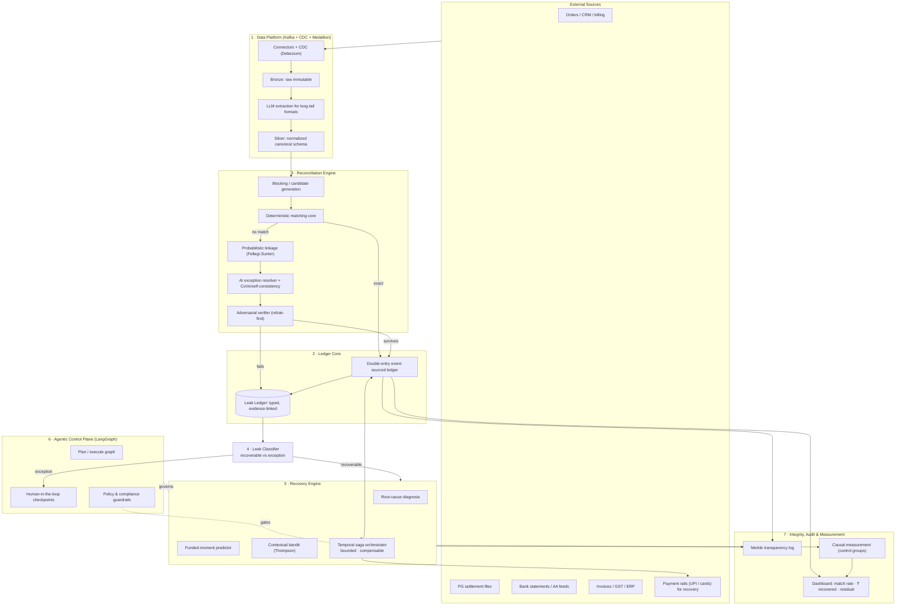
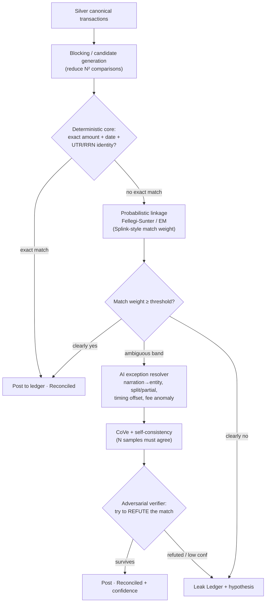
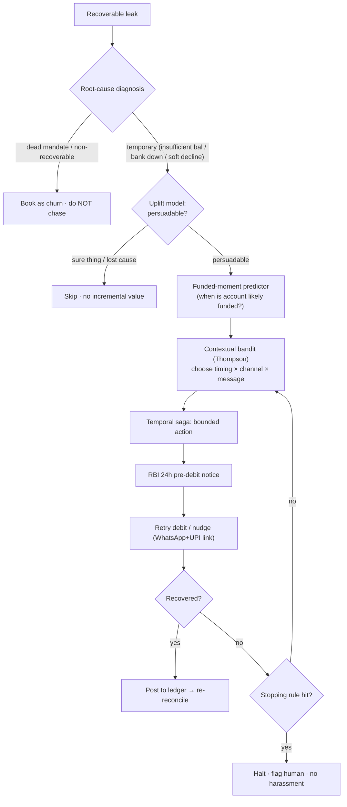
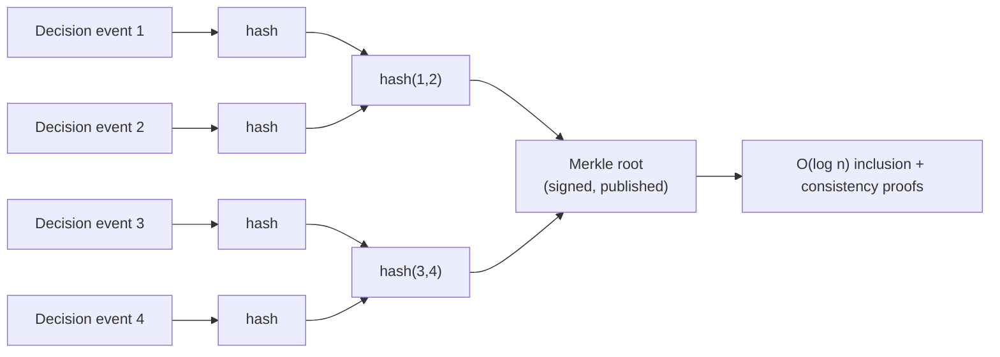
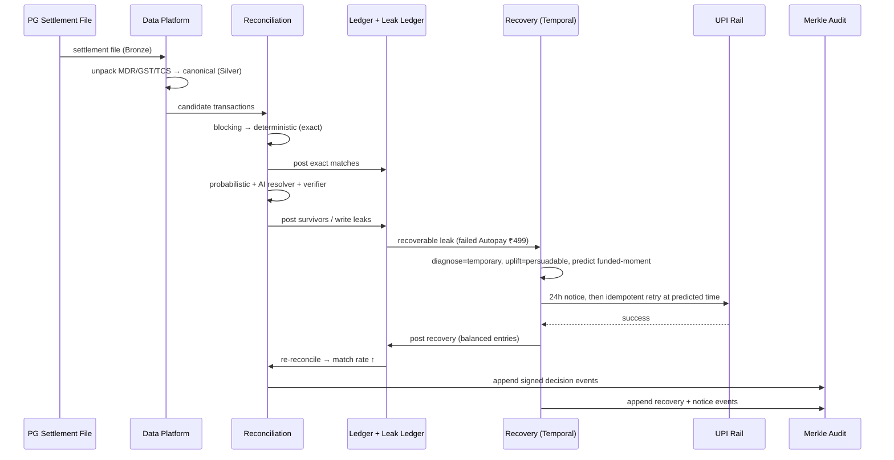

# RECLAIM — System Design & Architecture

### *Reconciliation-Enabled Closed-Loop AI for Integrity & Money-recovery*

> **A principal-engineer-grade architecture for a system that must be correct with money, honest about its limits, and safe to run autonomously.**

---

**Document type:** System Design & Architecture — v1.0
**Companion to:** `RECLAIM-Product-Document.md` (product vision) · `fintech-grid/` (market research)
**Research basis:** grounded in published papers, production engineering write-ups, and open-source projects — cited inline and in the Sources section, each with a confidence note. Where a design choice is our judgment rather than a sourced fact, it is labelled *design decision*.

---

## 0. How to read this document

This is written for an engineering team that will actually build RECLAIM. It states **goals → principles → architecture → each subsystem in depth → cross-cutting concerns → tech choices → trade-offs**. Every major decision is tied either to a source (a paper / OSS project / production write-up) or explicitly flagged as a design decision to be validated.

The single most important idea to carry through every layer:

> **RECLAIM is a *verification* system that happens to use AI — not an AI system that happens to verify.** Determinism owns the money math; AI is confined to ambiguous reasoning and is always a *gated proposal*, never an unchecked action. This is the design's whole safety story, and it maps directly to the 2026 thesis that verification, not generation, is the bottleneck.

---

## 1. Architecture goals & non-functional requirements

Adapted from the widely-cited principles of financial-ledger design ([Fintechly — Ledger System Design](https://fintechly.com/infrastructure/infrastructure-ledger-system-design/), [Formance — double-entry model](https://www.formance.com/blog/engineering/defining-double-entry)):

| # | Requirement | What it demands of RECLAIM | Confidence it's necessary |
|---|---|---|---|
| G1 | **Correctness** | Every posting balances; money math is exact, never probabilistic | High (core ledger principle) |
| G2 | **Completeness** | No money movement without a journal entry; no leak silently dropped | High |
| G3 | **Immutability & traceability** | Posted entries never mutate — corrections are new entries; every cent explained end-to-end | High |
| G4 | **Determinism** | Same inputs → same postings & same decisions (replayable) | High |
| G5 | **Idempotency / resilience** | Retries never double-pay or double-post | High |
| G6 | **Safe degradation** | Any AI/model failure degrades to "flag for human," never to a wrong match or wrong debit | High (design decision) |
| G7 | **Auditability** | Tamper-evident record of every action *and inaction*, cryptographically verifiable | High |
| G8 | **Bounded autonomy** | Every money action is gated, capped, reversible, and compliance-checked | High (regulatory) |
| G9 | **Causal honesty** | Recovery impact measured against a control, not asserted | High (design decision) |
| G10 | **Scale & latency** | Batch recon over millions of records; near-real-time leak detection; recovery within compliant time windows | Medium (target-dependent) |

---

## 2. Guiding principles (each tied to prior art)

1. **Deterministic core, AI at the edges.** Structured outputs turn an LLM call into "a typed function call, not text generation" ([LLM guardrails literature](https://leanware.co/insights/llm-guardrails)); we push all exact math into code and use the model only where rules genuinely break down.
2. **Every AI output is a proposal, gated by a verifier.** We combine **Chain-of-Verification (CoVe)**, **self-consistency** (sample N, require agreement on critical fields), and an **LLM-as-judge / adversarial refuter** — techniques shown to cut hallucinations materially (reported 15–82% across studies; 5–300 ms overhead) ([hallucination-mitigation review](https://www.preprints.org/manuscript/202505.1955), [structured-query hallucination detection](https://aclanthology.org/2025.findings-emnlp.873.pdf)).
3. **Double-entry, event-sourced, immutable ledger.** Money state is an append-only log of balanced debit/credit events, the model TigerBeetle enforces at the database level ([TigerBeetle docs](https://docs.tigerbeetle.com/single-page/)) and Uber/Stripe run at billions of events/day ([Uber Payments Platform](https://www.uber.com/us/en/blog/ubers-payments-platform/)).
4. **Probabilistic record linkage for fuzzy matching**, on the proven Fellegi-Sunter/EM foundation ([Splink](https://moj-analytical-services.github.io/splink/index.html)) — *below* a deterministic gate, never above it.
5. **Recovery is causal decision-making, not messaging.** Contextual bandits + uplift modeling target only *persuadable* customers and optimise incremental effect ([Amazon Science — contextual MAB for causal marketing](https://www.amazon.science/publications/contextual-multi-armed-bandits-for-causal-marketing)); Stripe's Smart Retries proves ML-timed retries recover materially at scale ([Stripe — How we built Smart Retries](https://stripe.com/blog/how-we-built-it-smart-retries)).
6. **Durable execution for every money action.** Sagas with idempotent, compensable activities on a durable engine (Temporal) so a crash never leaves money in limbo ([Temporal — Saga pattern](https://docs.temporal.io/design-patterns/saga-pattern)).
7. **Tamper-evident audit by construction.** Merkle/transparency-log history (Crosby–Wallach; RFC 6962 Certificate Transparency; QLDB/Trillian) giving O(log n) inclusion & consistency proofs ([transparency.dev / Trillian](https://transparency.dev/)).
8. **Human-in-the-loop as a first-class runtime state**, using a graph orchestrator that can pause, persist, and resume ([LangGraph 1.0 HITL](https://www.alphabold.com/langgraph-agents-in-production/)).

---

## 3. High-level architecture



**Seven layers, one loop:** data platform → ledger → reconciliation → classifier → recovery → agentic control → integrity/measurement. The **Ledger + Leak Ledger is the shared source of truth** that both the reconciliation and recovery halves read and write — the seam that makes RECLAIM one system instead of two.

---

## 4. Layer 1 — Data Platform

**Pattern:** Kafka as the real-time ingestion backbone, **Change Data Capture (Debezium)** for source systems, and a **medallion lakehouse** (Bronze → Silver → Gold) for lineage ([Kafka + Medallion streaming platform](https://medium.com/@msoumitra9925/how-we-built-a-real-time-streaming-data-platform-using-kafka-and-the-medallion-architecture-on-fc74d5985f42), [Databricks CDC pipelines](https://docs.databricks.com/aws/en/ldp/tutorial-pipelines)).

- **Bronze** — raw sources land exactly as received (settlement files, bank statements, order exports), immutable, replayable.
- **Silver** — cleaned, deduplicated, conformed into the **canonical transaction schema** (Appendix B). This is where **LLM extraction** earns its place: parsing the long tail of Indian bank narration and PDF statements that break rule-based parsers. Every extracted field is validated against a deterministic schema (typed function-call style) and low-confidence extractions are flagged, not guessed.
- **Gold** — reconciliation-ready, aggregated views.

**India-specific ingestion:** the **Account Aggregator (AA) framework** for consented bank-statement feeds, and PG settlement-file connectors (Razorpay/PayU/Cashfree) that unpack MDR / GST-on-MDR / TCS before anything downstream sees them. *(Design decision; AA integration to be validated.)*

**Why streaming + CDC, not batch uploads:** financial data "arrives as small, continuous updates instead of bulky daily uploads" — CDC captures every changed row, enabling near-real-time leak detection rather than T+1-only. We still run a **T+1 offline reconciliation replay** (the Uber pattern: Spark/Flink replays all logs vs bank vs ledger to catch drift the real-time path missed) ([Uber payments](https://www.uber.com/us/en/blog/ubers-payments-platform/)).

---

## 5. Layer 2 — Ledger Core

**Two structures, both append-only and immutable:**

### 5.1 The money ledger (double-entry, event-sourced)
Every money movement is a **balanced pair of debit/credit entries**; posted entries never change — corrections are new entries ([Formance](https://www.formance.com/blog/engineering/defining-double-entry)). This gives G1–G4 by construction. For the high-throughput core we adopt a **TigerBeetle-style debit/credit engine** that enforces financial consistency at the database level ([TigerBeetle](https://docs.tigerbeetle.com/single-page/)); a metadata/accounting layer (Formance-style) sits above for reconciliation, reporting, and Indian tax semantics.

> **Why double-entry even for a recon/recovery tool?** Because it makes "is the money whole?" a *provable invariant* (debits = credits) rather than a report. Recovered money posts as new balanced entries; the ledger *is* the closure proof.

### 5.2 The Leak Ledger (the seam)
A typed, append-only store of every rupee that fails to reconcile:
```
LeakRecord { id, amount, currency, type, source_refs[],
             hypothesis, confidence, recoverable(bool),
             recovery_state, evidence[], audit_ref }
```
It is the integration contract between reconciliation (writer) and recovery (reader/writer), and the object the human exception queue renders. Nothing leaves the system undocumented (G2).

---

## 6. Layer 3 — Reconciliation Engine (the two-brain design)



**Stage by stage:**
1. **Blocking / candidate generation** — the classic ER scaling trick: only compare records within the same block (e.g. same date-window + amount-bucket) to avoid O(N²) ([enterprise ER pipeline, arXiv](https://arxiv.org/pdf/2508.03767)). Splink links ~1M records/minute on a laptop using this approach ([Splink](https://www.robinlinacre.com/introducing_splink/)).
2. **Deterministic core** — exact arithmetic and identity matches (amount after unpacking fees, date, UTR/RRN). Code, not model. If it matches exactly, it posts. **This gate is inviolable — no AI decides equality of money.**
3. **Probabilistic linkage** — for non-exact candidates, a **Fellegi-Sunter model with EM-estimated match weights** (Splink/Zingg/dedupe lineage) produces a calibrated match probability. Clear matches post; clear non-matches leak; only the **ambiguous band** escalates to AI.
4. **AI exception resolver** — reasons about genuinely fuzzy joints (narration→entity, split/partial refunds, timing offsets, unexplained fees) using **structured outputs**.
5. **Verification stack** — every AI proposal runs **Chain-of-Verification + self-consistency** (multiple independent samples must agree on critical fields; disagreement → uncertainty → escalate) and then an **adversarial verifier** that is prompted to *refute* the match. Only survivors post; the rest become leaks with a stated hypothesis and confidence.

**Confidence calibration** is monitored continuously — a claimed-90%-confidence match must be right ~90% of the time, or the thresholds recalibrate. This is what keeps the "honest exception list" honest.

---

## 7. Layer 5 — Recovery Engine (causal decision-making)

Recovery is modelled as a **budget-constrained causal decision problem**, not a messaging campaign.



**Components:**
- **Root-cause diagnosis** — classify failure (temporary vs dead mandate vs soft decline). Don't chase the dead; don't harass. Mirrors Stripe's decline-code-aware retry logic ([Slicker — soft-decline retries](https://www.slickerhq.com/resources/blog/smart-payment-retries-error-code-05-fix-soft-declines-automatically)).
- **Uplift model** — target only *persuadable* customers, skipping "sure things" and "lost causes," to optimise **incremental** recovery per rupee of effort ([Amazon Science causal MAB](https://arxiv.org/pdf/1810.01859); [preventing churn like a bandit](https://medium.com/bigdatarepublic/preventing-churn-like-a-bandit-49b7c51b4929)).
- **Funded-moment predictor** — per-customer model of *when* an account is likely funded (the Stripe Smart Retries insight: ML-timed retries on billions of data points beat fixed schedules) ([Stripe](https://stripe.com/blog/how-we-built-it-smart-retries)).
- **Contextual bandit (Thompson sampling)** — learns the best `(timing × channel × message)` per context, balancing exploration/exploitation, with **offline policy evaluation via Inverse Propensity Scoring / Doubly Robust** so we can validate a new policy *before* deploying it ([contextual bandit overview](https://towardsdatascience.com/an-overview-of-contextual-bandits-53ac3aa45034/)).
- **Bounded compliant orchestrator (Temporal saga)** — each recovery is a durable workflow of idempotent, compensable activities. Idempotency key = `WorkflowRunID + ActivityID` for every external call (the documented pattern), so a crash-and-retry never double-debits ([Temporal saga](https://docs.temporal.io/design-patterns/saga-pattern), [Temporal idempotency](https://temporal.io/blog/error-handling-in-distributed-systems)). Hard **stopping rules** (contact caps, RBI 24h notice, consent) are enforced in the workflow, not left to a model.

> **Critical caveat we design around** ([Temporal docs]): durable execution does *not* by itself make a gateway request exactly-once — so the debit activity carries its own idempotency key and the gateway's own idempotency support is mandatory. Money actions are idempotent end-to-end or they don't ship.

---

## 8. Layer 6 — Agentic Control Plane

The autonomous behaviour is orchestrated as a **graph**, not a free-running agent loop — chosen for reliability, HITL, and durability.

- **LangGraph** (1.0, production-stable Oct 2025) for stateful graph orchestration with **durable execution, streaming, human-in-the-loop, and memory** ([LangGraph in production](https://www.alphabold.com/langgraph-agents-in-production/)). A **checkpointer (Postgres)** lets any decision pause, persist, and resume — essential for exception approval and high-value recovery sign-off ([HITL agentic workflows](https://towardsdatascience.com/building-human-in-the-loop-agentic-workflows/)).
- **Plan–execute** rather than react-only: an explicit planning step reduces missing-step errors (Plan-and-Solve).
- **Guardrails as input/output validation layers** around every model call (Guardrails AI / NeMo Guardrails / OpenAI Agents-SDK style), plus **tracing** for end-to-end observability.
- **HITL gates** are typed states, not afterthoughts: any action above a value threshold, any low-confidence match, and any novel exception routes to a human and *waits*.

> Design stance: the graph *plans and proposes*; the deterministic core, the saga guardrails, and the ledger invariants *decide and enforce*. An agent can never move money by "deciding to" — it can only enqueue a bounded, gated, idempotent saga.

---

## 9. Layer 7 — Integrity, Audit & Measurement

### 9.1 Tamper-evident audit
Every match, recovery action, and *decision not to act* is appended to a **Merkle-tree transparency log** (Crosby–Wallach history tree; the model behind RFC 6962 Certificate Transparency and QLDB/Trillian) giving **O(log n) inclusion and consistency proofs** — any later deletion or edit is cryptographically detectable ([Trillian / transparency.dev](https://transparency.dev/), [Merkle audit-log survey](https://arxiv.org/html/2605.00065v1)). This satisfies G7 and the statutory audit-trail expectation for books.



### 9.2 Causal measurement subsystem
- A **held-out control group** for every recovery policy; reported metric = treated recovery **minus** control baseline (causal lift), not raw recovery.
- **Offline policy evaluation** (IPS / Doubly Robust) gates any new bandit policy before it touches real customers ([adaptive doubly-robust estimator, arXiv](https://arxiv.org/pdf/2010.03792)).
- **Model/threshold drift monitors** on match calibration and recovery uplift; degradation auto-raises thresholds toward "flag for human."

### 9.3 The scorecard (ungameable by design)
`match rate → ₹ causally recovered (vs control) → residual exception list → false-positive/harassment rate → time-to-closure`. Batch-level, control-adjusted, and honesty-first.

---

## 10. Cross-cutting: Security, Compliance & Governance

| Concern | Approach | Source / basis |
|---|---|---|
| Recurring-debit rules | Enforce RBI e-mandate: ≤₹15,000 without AFA (₹1 lakh for insurance/MF/credit-card categories); **mandatory 24h pre-debit notice** in the saga | research grid T03 (Medium-High, verified) |
| Collections conduct | Contact caps / timing / stopping rules encoded as hard workflow constraints | RBI norms (Medium) |
| Data protection | DPDP: least-privilege, purpose-bound PII, tenant isolation, encryption at rest/in transit | research grid (High) |
| Multi-tenancy | Per-tenant data isolation; per-tenant ledger namespaces | design decision |
| Secrets & keys | KMS-managed; signing keys for the transparency log rotated & published | design decision |
| Reversibility | No irreversible money action without a logged, consented HITL gate | G6/G8 |

---

## 11. Tech stack — choices & rationale (build vs buy)

| Layer | Choice | Rationale | Alt considered |
|---|---|---|---|
| Ingestion | Kafka + Debezium CDC | Decouple producers/consumers; capture every change near-real-time | Batch ETL (rejected: T+1 only) |
| Lakehouse | Delta/medallion (Bronze/Silver/Gold) | Lineage + replayability + immutable raw | Warehouse-only (weaker lineage) |
| Money ledger | TigerBeetle-style engine + Formance-style metadata layer | DB-level debit/credit invariants; proven at billions/day | Postgres-only ledger (viable at MVP) |
| Fuzzy matching | Splink / Fellegi-Sunter (EM) | Proven, calibrated, scales to 100M+ | Pure-ML matcher (harder to calibrate/explain) |
| AI resolver | LLM w/ structured outputs + CoVe + self-consistency + judge | Confines AI, gates every output | Free-form LLM (rejected: unsafe) |
| Recovery ML | Contextual bandit (Thompson) + uplift + IPS/DR eval | Optimises incremental recovery, safe offline eval | Fixed retry schedule (leaves money) |
| Orchestration | Temporal (sagas) | Durable, compensable, idempotent money workflows | Ad-hoc queues (rejected: limbo states) |
| Agentic control | LangGraph (checkpointer=Postgres) | Durable graph + HITL + tracing | Free-running agent loop (rejected: reliability) |
| Audit | Merkle transparency log (Trillian-style) | Cryptographic tamper-evidence, O(log n) proofs | Plain append log (not verifiable) |

*(Confidence: the patterns are High — each is production-proven; the *specific vendor* picks are Medium design decisions, swappable behind interfaces.)*

---

## 12. Reference runtime flow — a settlement batch, end to end



---

## 13. Reliability, scaling & failure modes

- **Idempotency everywhere** — every external effect keyed; at-least-once delivery + idempotent handlers = effective exactly-once ([Temporal](https://temporal.io/blog/error-handling-in-distributed-systems)).
- **Saga compensation** — registered before execution, idempotent, guaranteed to run even after worker failure.
- **Backpressure & replay** — Kafka + medallion Bronze lets any stage be replayed deterministically (G4).
- **Scale path** — Splink/Spark for 100M+ record recon; TigerBeetle-class throughput for postings; bandit inference is cheap per-decision.
- **Degradation ladder** — model down → probabilistic-only + human queue; probabilistic uncertain → human queue; gateway idempotency unavailable → recovery paused (never a blind debit).

---

## 14. Trade-offs & rejected alternatives (honest)

- **Complexity vs. safety.** This is a heavy architecture. Justified *only* because the domain is money; at MVP, several components collapse (Postgres ledger, no Kafka, batch recon) without changing the principles — see roadmap.
- **Two matchers (deterministic + probabilistic) vs. one ML matcher.** We deliberately keep them separate for explainability and calibration, accepting more code. A single learned matcher would be simpler but un-auditable — unacceptable for G3/G6.
- **Bandit exploration vs. customer experience.** Exploration risks a suboptimal nudge to a real customer; we cap exploration and gate offline (IPS/DR) to bound this.
- **LangGraph vs. Temporal overlap.** LangGraph orchestrates *reasoning*; Temporal orchestrates *money*. They coexist by role; using either for both was rejected.
- **AA/consent friction.** Consent-based bank feeds add onboarding friction; the alternative (statement uploads) is lower-fidelity. We support both.

---

## 15. Phased build (maps to the product roadmap)

| Phase | Architecture scope | Deliberately deferred |
|---|---|---|
| **P0 — Proof** | Postgres ledger + Leak Ledger; deterministic + Splink matching; AI resolver w/ verifier; one recovery saga (UPI Autopay); basic audit log; synthetic + 1 design partner | Kafka, TigerBeetle, full bandit, Merkle log |
| **P1 — Wedge** | Kafka+CDC ingestion; more Indian formats; uplift + bandit w/ offline eval; Merkle transparency log; HITL console | Multi-tenant scale-out |
| **P2 — Platform** | TigerBeetle-class ledger; Spark-scale recon; cross-PG; ERP/GST + AA integrations; outcome-pricing meter | — |
| **P3 — Integrity layer** | Verification/recovery across **agentic** money movement | — |

---

## 16. Open questions to de-risk (per our operating rules)

1. **Recoverable-share & uplift** — the numbers that drive ROI *and* the bandit reward; validate with real failed-payment cohorts.
2. **Calibration at low volume** — can per-customer funded-moment prediction and causal lift be estimated reliably for small merchants? (may need hierarchical/pooled models).
3. **Indian format coverage cost** — the real long-tail of bank/settlement formats determines ingestion effort and moat depth.
4. **Exact compliance limits** — RBI collections-conduct specifics and AA integration constraints (confirm with payments counsel).
5. **Where LLM extraction is safe** — quantify extraction error rates on Indian statements before trusting Silver-layer fields.

> These are the same low-confidence items flagged in the market research; the architecture is explicitly designed so that being wrong about them degrades gracefully (human queue, paused recovery) rather than dangerously.

---

## Appendix A — Component API sketches
```
POST /ingest            (source_type, payload)             -> bronze_ref
POST /reconcile         (batch_id)                          -> {match_rate, posted[], leaks[]}
GET  /leaks             (?recoverable=true)                 -> LeakRecord[]
POST /recover           (leak_id, policy_id)                -> saga_id   (durable)
GET  /audit/proof       (event_id)                          -> merkle_inclusion_proof
GET  /scorecard         (tenant, period)                    -> {match_rate, causal_recovered, residual, fp_rate, ttc}
```

## Appendix B — Canonical schemas
```
Transaction { id, source, gross_amount, net_amount, currency,
              fees:{mdr,gst_on_mdr,tcs,other}, refs:{order_id,utr,rrn,invoice_no},
              ts, counterparty, narration_raw, match_status, match_confidence, evidence[] }
LeakRecord  { id, amount, type, source_refs[], hypothesis, confidence,
              recoverable, recovery_state, evidence[], audit_ref }
LedgerEntry { id, txn_id, account, direction(debit|credit), amount, ts, immutable=true }
```

## Appendix C — Glossary
Fellegi-Sunter (probabilistic record-linkage model) · EM (expectation-maximisation) · CoVe (Chain-of-Verification) · IPS/DR (Inverse Propensity Scoring / Doubly Robust offline policy evaluation) · Saga (compensable distributed transaction) · CDC (Change Data Capture) · MDR/GST-on-MDR/TCS (settlement deductions) · UTR/RRN (transaction reference ids) · AA (Account Aggregator).

---

## Sources & Confidence
Production write-ups and papers cited inline. Highest-confidence, load-bearing sources:
- **Splink / Fellegi-Sunter** — [MoJ Splink docs](https://moj-analytical-services.github.io/splink/index.html), [Robin Linacre](https://www.robinlinacre.com/introducing_splink/), [enterprise ER pipeline (arXiv 2508.03767)](https://arxiv.org/pdf/2508.03767) *(High)*
- **Ledger design** — [TigerBeetle docs](https://docs.tigerbeetle.com/single-page/), [Formance double-entry](https://www.formance.com/blog/engineering/defining-double-entry), [Fintechly ledger principles](https://fintechly.com/infrastructure/infrastructure-ledger-system-design/), [Uber Payments Platform](https://www.uber.com/us/en/blog/ubers-payments-platform/) *(High)*
- **LLM verification** — [hallucination-mitigation review (Preprints)](https://www.preprints.org/manuscript/202505.1955), [structured-query hallucination detection (EMNLP 2025)](https://aclanthology.org/2025.findings-emnlp.873.pdf), [LLM guardrails](https://leanware.co/insights/llm-guardrails) *(Medium-High)*
- **Causal bandits / recovery** — [Amazon Science contextual MAB (arXiv 1810.01859)](https://arxiv.org/abs/1810.01859), [Stripe Smart Retries](https://stripe.com/blog/how-we-built-it-smart-retries), [Stripe Adaptive Acceptance](https://stripe.com/blog/ai-enhancements-to-adaptive-acceptance), [preventing churn like a bandit](https://medium.com/bigdatarepublic/preventing-churn-like-a-bandit-49b7c51b4929) *(High for Stripe results; Medium for transfer to our context)*
- **Durable orchestration** — [Temporal Saga pattern](https://docs.temporal.io/design-patterns/saga-pattern), [Temporal error handling/idempotency](https://temporal.io/blog/error-handling-in-distributed-systems) *(High)*
- **Tamper-evident audit** — [transparency.dev / Trillian](https://transparency.dev/), [Merkle audit-log verification (arXiv 2605.00065)](https://arxiv.org/html/2605.00065v1) *(High)*
- **Agentic orchestration** — [LangGraph in production](https://www.alphabold.com/langgraph-agents-in-production/), [HITL agentic workflows (TDS)](https://towardsdatascience.com/building-human-in-the-loop-agentic-workflows/) *(Medium-High)*
- **Data platform** — [Kafka + Medallion streaming](https://medium.com/@msoumitra9925/how-we-built-a-real-time-streaming-data-platform-using-kafka-and-the-medallion-architecture-on-fc74d5985f42), [Databricks CDC](https://docs.databricks.com/aws/en/ldp/tutorial-pipelines) *(Medium-High)*

**Note on confidence:** the *architectural patterns* are production-proven (High). Their *specific application to RECLAIM* and the India-specific integrations (AA, PG formats, exact RBI limits) are design intent to be validated (§16). Vendor/tool choices are swappable behind interfaces and should be treated as defaults, not commitments.
